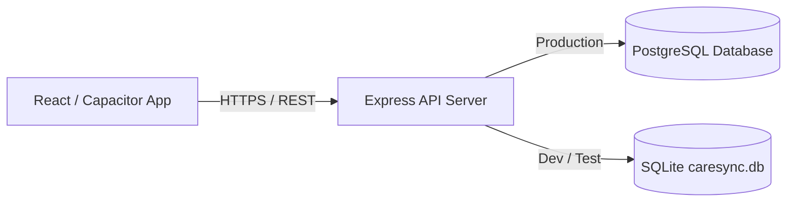
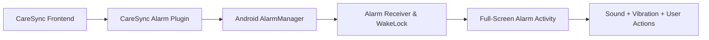

# CareSync

CareSync is a healthcare companion application designed to help patients manage daily medication schedules and hydration routines while allowing caregivers to stay connected in real time. Built with React, TypeScript, Capacitor, and native Android components, CareSync provides reliable background alarms that wake locked devices, deterministic wellness scoring via CareScore, offline action queuing, and multi-tier caregiver escalation alerts.

---

## Features

- **Patient & Caregiver Accounts**: Role-based access with JWT authentication and rotating refresh tokens.
- **Patient–Caregiver Connection**: Ephemeral 7-day pairing codes (`CARE-XXXXXX`) for secure, instant account linking.
- **Medication Scheduling & Reminders**: Multi-slot scheduling across morning, afternoon, and evening with recurrence rules.
- **Hydration Tracking & Reminders**: Daily intake goals in liters with customizable interval reminders and quick logging.
- **Native Android Alarm System**: Exact alarm scheduling via `AlarmManager.setAlarmClock()` and boot persistence.
- **Lock-Screen & Full-Screen Alarms**: Custom `CareSyncAlarmActivity` that wakes up the device over the lock screen.
- **Native Sound & Vibration**: Looping alarm audio (`R.raw.beep`) at maximum alarm volume and repeating vibration waveforms.
- **Confirm, Snooze & Dismiss Actions**: Native actions directly accessible from the alarm screen and notification shade.
- **CareScore & Routine Insights**: Deterministic 0–100 wellness index across medications, hydration, steps, and routines.
- **Offline Action Handling**: Queues confirmations and logs locally when disconnected, syncing automatically once online.
- **Caregiver Escalation & Alerts**: Multi-tier alert worker evaluating unconfirmed doses and notifying caregivers via FCM.

---

## Tech Stack

| Layer | Technologies |
|---|---|
| **Frontend** | React 19, TypeScript, Vite 6, Tailwind CSS v4, Lucide React, Motion |
| **Mobile Runtime** | Capacitor 8 (`@capacitor/core`, `@capacitor/android`, `@capacitor/local-notifications`, `@capacitor/haptics`) |
| **Android Native** | Java, Android SDK 36 (Min SDK 24), `AlarmManager`, `BroadcastReceiver`, `KeyguardManager`, `PowerManager` |
| **Backend & API** | Node.js, Express 4, TypeScript, Helmet, CORS, Rate Limiting, JWT Auth, `bcryptjs` |
| **Database** | PostgreSQL 16+ via `pg` (Production) / SQLite via `better-sqlite3` in WAL mode (Dev & Test) |
| **Push Notifications** | Firebase Cloud Messaging (FCM) |

---

## Architecture

### 1. Application Data Flow


### 2. Native Android Alarm Flow


---

## Getting Started

### Prerequisites
- **Node.js**: v18.x or v20.x+
- **JDK**: JDK 17 or JDK 21 (Required for Android builds)
- **Android Studio & SDK**: Android SDK 36 (Platform-Tools, Build-Tools)

### 1. Clone & Install Dependencies
```bash
git clone https://github.com/vishalvivek14332/CareSync-Healthcare-Companion.git
cd CareSync-Healthcare-Companion
npm install
```

### 2. Configure Environment
```bash
cp .env.example .env
```

### 3. Run Development Server
```bash
npm run dev
```
Open [http://localhost:3000](http://localhost:3000)

### 4. Build Web & Server Bundle
```bash
npm run build
```

### 5. Sync Capacitor Android
```bash
npx cap sync android
```

### 6. Build Android Debug APK
```powershell
cd android
.\gradlew.bat assembleDebug
```
Output: `android/app/build/outputs/apk/debug/app-debug.apk`

### 7. Run Test Suites
```bash
npx tsx tests/e2e.test.ts          # End-to-End Workflow & Security Tests
npx tsx tests/scheduling.test.ts   # Scheduling & Recurrence Engine Tests
npx tsx tests/escalation.test.ts   # Escalation Worker Tests
npx tsx tests/postgres.test.ts     # Database Abstraction & PostgreSQL Tests
```

---

## License

No license is currently specified for this repository.
